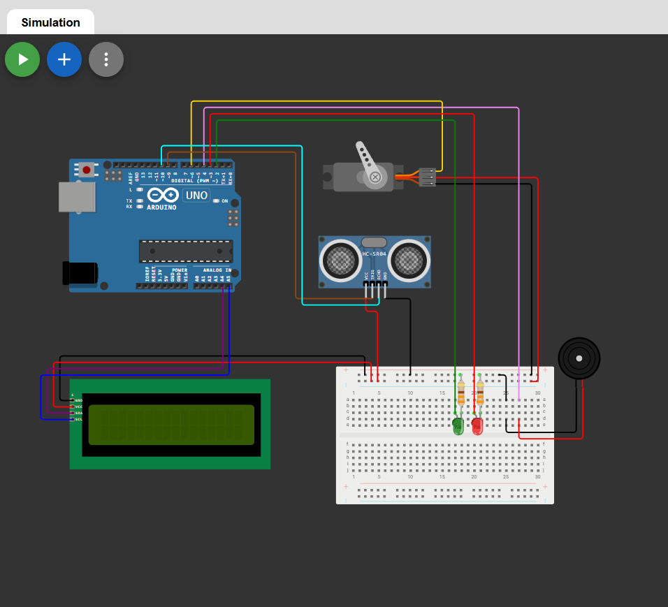

# 🚨 Alarme Inteligente - Sistemas Embarcados

## 📌 Sobre o Projeto
O **Alarme Inteligente** é um sistema embarcado desenvolvido com o objetivo de monitorar ambientes e detectar movimentações suspeitas utilizando sensores e atuadores integrados a um microcontrolador.

O projeto simula um sistema de segurança automatizado, capaz de identificar presença, emitir alertas visuais e sonoros e aumentar a proteção de ambientes residenciais ou comerciais.

---

  

---

## 🎯 Objetivos
- Detectar presença ou movimento em um ambiente
- Emitir alertas através de LEDs e buzzer
- Simular um sistema de segurança automatizado
- Aplicar conceitos de sistemas embarcados na prática

---

## 🧠 Tecnologias e Componentes Utilizados
- Arduino UNO  
- Sensor ultrassônico (HC-SR04)  
- LEDs (vermelho e verde)  
- Buzzer  
- Display LCD I2C (opcional)  
- Linguagem C/C++ (Arduino IDE)

---

## ⚙️ Funcionamento do Sistema
1. O sensor ultrassônico mede a distância constantemente  
2. Quando um objeto é detectado dentro de um limite definido:
   - 🔴 LED vermelho é acionado  
   - 🔊 Buzzer emite alerta sonoro  
3. Caso não haja detecção:
   - 🟢 LED verde permanece aceso  
4. (Opcional) Informações são exibidas no display LCD
   
---

## 🔧 Como Executar o Projeto

### 🔌 Montagem do Circuito
- Conecte o sensor ultrassônico aos pinos digitais  
- Ligue os LEDs com resistores de **220Ω**  
- Conecte o buzzer ao pino digital configurado  
- (Opcional) Conecte o display LCD via I2C  

### 💻 Upload do Código
1. Abra o Arduino IDE  
2. Conecte o Arduino ao computador  
3. Selecione a porta correta  
4. Faça o upload do código  

---

## 🚀 Possíveis Melhorias
- 📡 Integração com Wi-Fi (ESP8266 / ESP32)  
- 📱 Envio de notificações para celular  
- 🤖 Integração com bots (Telegram / WhatsApp)  
- 🔐 Sistema com senha ou RFID  
- 🌐 Monitoramento remoto em tempo real  

---

## 📚 Aprendizados
- Leitura de sensores  
- Controle de atuadores  
- Lógica de sistemas embarcados  
- Integração hardware + software  

---

## 🤝 Contribuição
Contribuições são bem-vindas!  
Sinta-se livre para abrir **issues** ou enviar **pull requests**.
